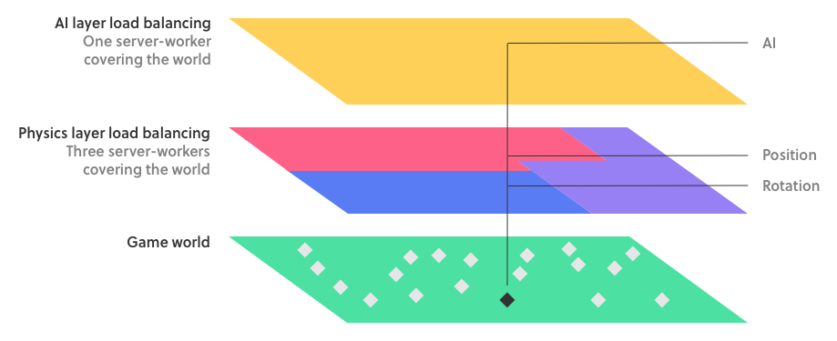
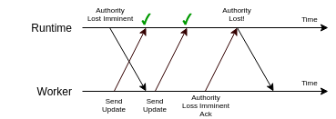

# Infinite nesting starts here: Guide

la la la [testing](http://improbable.io) jhsjhsjhsghs,



## Getting Super Powers

Becoming a super hero is a fairly `straight` forward process:

```
$ give me super-powers
```


 Super-powers are granted randomly so please submit an issue if you're not happy with yours.






Once you're strong enough, save the world:

```
// Ain't no code for that yet, sorry
echo 'You got to trust me on this, I saved the world'
```

* [ ] fsffds
* [ ] fsffa



